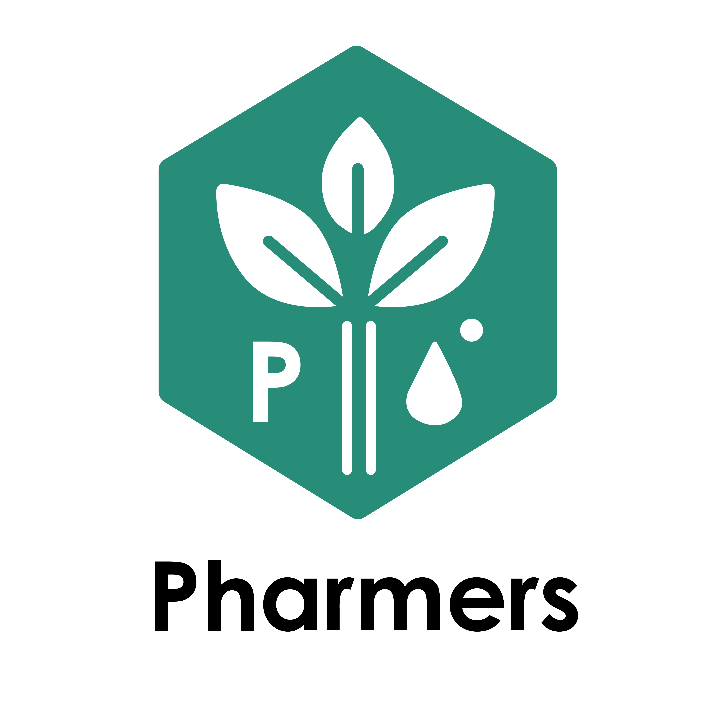

# Pharmer Project

Pharmer is a project developed in the CBI for the AI Course provided by Atract Academy, ESADE, IED (European Design Institute), and UPC (Universitat Politècnica de Catalunya) during the spring term of 2024.

Our primary objective is to enhance the management of agricultural wastewater by detecting and extracting phosphorus. This phosphorus is then returned to farmers as fertilizer, establishing a circular system. This method addresses water pollution while creating economic value. We collect and analyze data throughout the process to predict and manage phosphorus pollution. Located in Torre de Segre, Spain, the project requires an initial investment of 1 million euros and aims to prevent ecological damage worth 1 million euros annually. It is projected to become profitable within five years, fostering environmental health and supporting local agriculture.

## Project developers:
- Diego Renato Canovas (renato.canova.1196@gmail.com)
- Isabelle Soares (i.gomessoares1@ied.edu)
- Roshini Selvakumar (r.selvakumar@ied.edu)
- Xinyu Tang (txy604929345@gmail.com)
- Anna Falceto Piñol (annafalpi@gmail.com)

