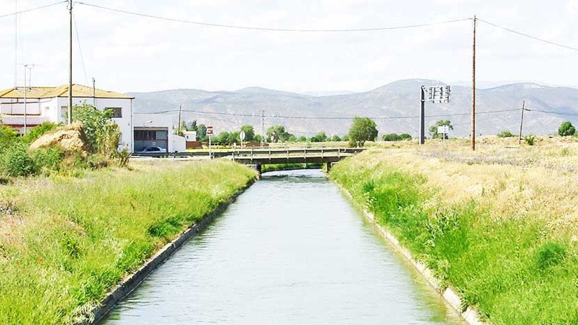
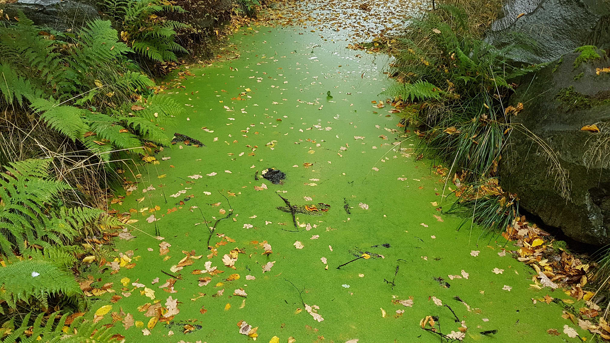
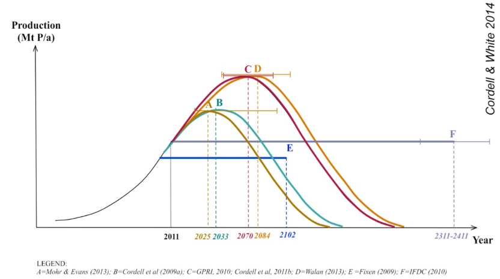
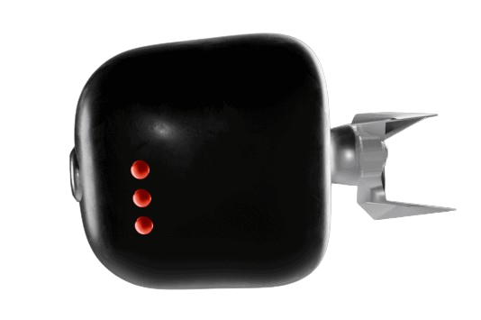
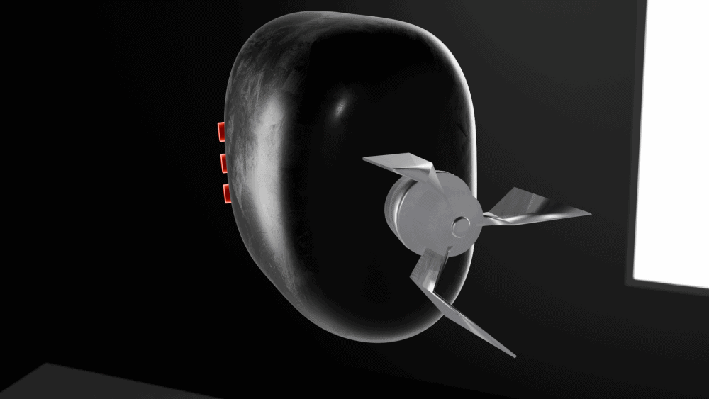
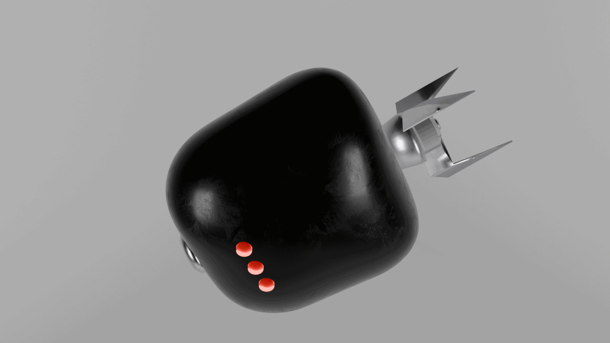
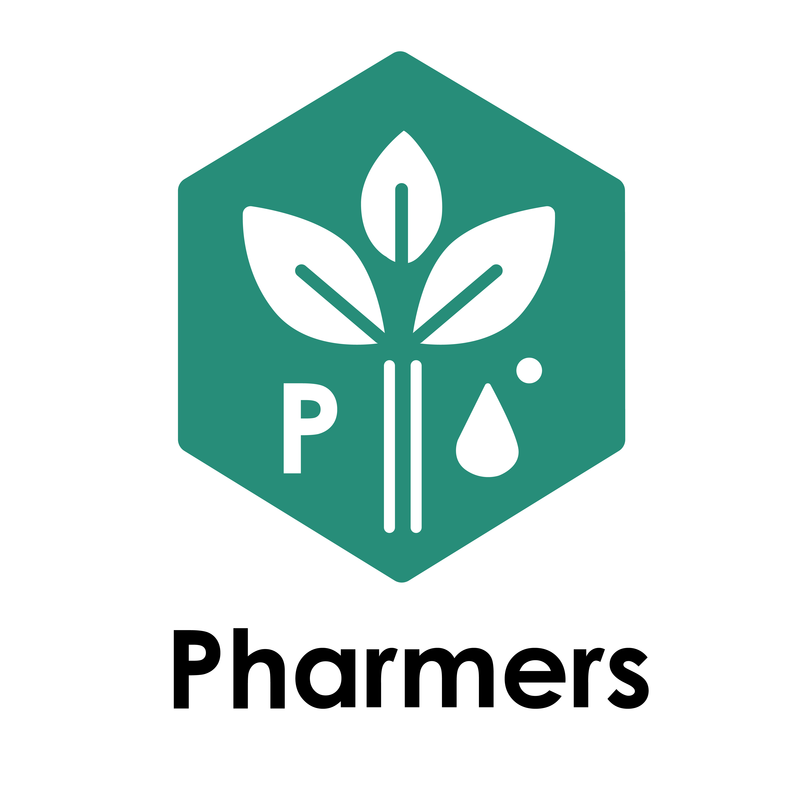

# ThePharmer Project

Pharmer is a project developed in the CBI for the AI Course provided by Atract Academy, ESADE, IED (European Design Institute), and UPC (Universitat Politècnica de Catalunya) during the spring term of 2024.

Our innovative project addresses the critical issue of agricultural wastewater treatment by focusing on phosphorus extraction and recycling. Through advanced detection techniques combined with the ATTRACT technologies, we capture phosphorus from wastewater and transform it into valuable fertilizer for local farmers. This circular approach not only mitigates water pollution but also fosters economic benefits, creating a sustainable agricultural ecosystem. By monitoring and analyzing data throughout the process, we enhance our ability to predict and manage phosphorus pollution effectively. This initiative not only champions environmental health but also bolsters the agricultural productivity of the region.

## Wastewater - From Residue to Resource:

Water pollution is a global issue affecting both developed and developing nations. According to the United Nations, over 80% of the world's wastewater is released into the environment without adequate treatment. Agricultural wastewater pollution is the No.1 source of water contamination, arising from the runoff of fertilizers, pesticides, and other chemicals used in farming. This type of pollution has widespread environmental and health impacts and it leads to the degradation of water quality in rivers, lakes, and groundwater, affecting ecosystems and human communities that rely on these water sources for drinking, irrigation, and other uses.

Phosphorus is an essential nutrient for plant growth and a vital component of agricultural fertilizers. For this reason, its use is common in agricultural treatment, being the presence derived from its use highly elevated in water bodies near the agricultural activity. This high presence of phosphorous in the water causes eutrophication.

* Eutrophication is a critical environmental issue caused by the enrichment of water bodies with nutrients, particularly phosphorus and nitrogen. This nutrient overload stimulates the excessive growth of algae and aquatic plants, leading to harmful algal blooms. These blooms can severely deplete oxygen levels in the water, creating dead zones where aquatic life cannot survive

In addition, phosphorus is an essential nutrient for plant growth and a vital component of agricultural fertilizers. However, phosphorus is a non-renewable resource, and its reserves are being depleted at an alarming rate. The scarcity of phosphorus poses a significant challenge to the sustainability of agricultural production.

  

    
    
    
  

## The Pharmers solution

At pharmers we present a circular solution for the collection and reuse of phosphorus from agricultural canales. 

Our solution consists of two different agents that will allow the monitoring of the state of the carcass and its subsequent phosphorus extraction.

* The first agent of our system is a small device in charge of going through the carcass collecting data on the amount of phosphorus present in the carcass. This device, also called Croco, can be seen as a small autonomous submarine that, by means of a battery, navigates inside the canal to detect the presence of phosphorus in the canal using an electrochemical sensor. The solution proposes the provision of a fleet of these Crocos.

  

    
    
    
  

* The second agent is a device in charge of extracting the phosphorus from the canala and will be called **Pharmer**. The **Pharmer** consists of a mobile barge driven by motors powered by the solar panels installed on the surface of the Pharmer (which are also used to charge the Crocuses, as mentioned above).
  
  

  

  

    
    
    
  

  To extract the phosphorus, the Pharmer will have 3 removable drawers filled with Polonite, an absorbent material capable of capturing the phosphorus through filtration. It is important to remark that phosphorus enriched Polonite itself can be used as fertilizer and compost.

  

Finally, it is proposed to use the data collected by the Crocos for the creation of an interactive monotirage tool that, through a LSTM prediction algorithm, will allow not only to report the state of the channel but also to provide future predictions to avoid possible natural disasters, such as the cut-off of water supply due to the high level of contamination.

<table style="border-collapse: collapse; width: 100%;">

  
  
  

## Project developers:
- Diego Renato Canovas (renato.canova.1196@gmail.com)
- Isabelle Soares (i.gomessoares1@ied.edu)
- Roshini Selvakumar (r.selvakumar@ied.edu)
- Xinyu Tang (txy604929345@gmail.com)
- Anna Falceto Piñol (annafalpi@gmail.com)

